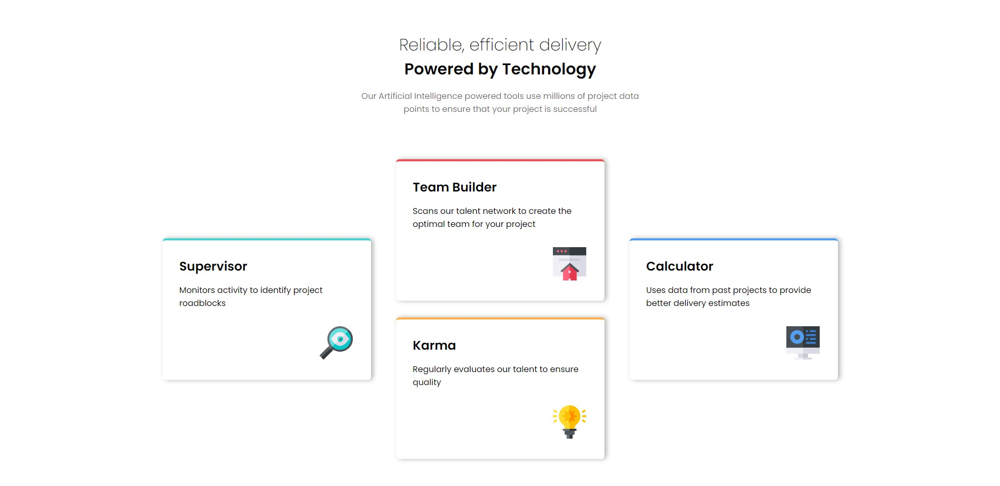
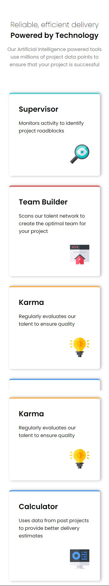

# Frontend Mentor - Four card feature section solution

This is a solution to the [Four card feature section challenge on Frontend Mentor](https://www.frontendmentor.io/challenges/four-card-feature-section-weK1eFYK). Frontend Mentor challenges help you improve your coding skills by building realistic projects.

## Table of contents

- [Overview](#overview)
  - [The challenge](#the-challenge)
  - [Screenshot](#screenshot)
  - [Links](#links)
- [My process](#my-process)
  - [Built with](#built-with)
  - [What I learned](#what-i-learned)

## Overview

### The challenge

Users should be able to:

- View the optimal layout for the site depending on their device's screen size

### Screenshot





### Links

- Solution URL: [https://github.com/Sammed-NJ/single-price-grid-component.git](https://github.com/Sammed-NJ/single-price-grid-component.git)
- Live Site URL: [https://single-price-grid-component-sammednj.netlify.app/](https://single-price-grid-component-sammednj.netlify.app/)

## My process

### Built with

- Semantic HTML5 markup
- CSS custom properties
- Flexbox
- Mobile-first workflow

### What I learned

This was usefull challenge.

```html
<div class="head-container">
  <div class="text-container">
    <h1>Reliable, efficient delivery</h1>
    <h2>Powered by Technology</h2>

    <p>
      Our Artificial Intelligence powered tools use millions of project data
      points to ensure that your project is successful
    </p>
  </div>
</div>

<div class="cards-container">
  <div class="links card-container-1">
    <div class="card card-1">
      <h2>Supervisor</h2>
      <p>Monitors activity to identify project roadblocks</p>
      
    </div>
  </div>

  <div class="links card-container-2">
    <div class="card card-2">
      <h2>Team Builder</h2>
      <p>
        Scans our talent network to create the optimal team for your project
      </p>
      
    </div>

    <div class="card card-3">
      <h2>Karma</h2>
      <p>Regularly evaluates our talent to ensure quality</p>
      
    </div>
  </div>

  <div class="links card-container-3">
    <div class="card card-4">
      <h2>Calculator</h2>
      <p>Uses data from past projects to provide better delivery estimates</p>
      
    </div>
  </div>
</div>
```

```css
* {
  margin: 0;
  padding: 0;
  box-sizing: border-box;
}

body {
  font-family: "Poppins", sans-serif;
  display: flex;
  flex-direction: column;
}

.head-container {
  min-height: 30vh;
  text-align: center;
  padding: 4rem 0;
}

.head-container h1 {
  font-weight: 200;
}

.head-container h2 {
  font-size: 1.9rem;
  margin: 0 0 1rem 0;
}

.head-container p {
  width: 30%;
  opacity: 0.6;
  margin: auto;
}

.cards-container {
  width: 70%;
  margin: auto;
  min-height: 65vh;
  display: flex;
  justify-content: space-around;
  flex-wrap: wrap;
}

.cards-container .card-container-1,
.card-container-2,
.card-container-3 {
  align-self: center;
}

.cards-container .card-container-1,
.card-container-3 {
  margin: 1rem 0;
}

.cards-container .card-container-2 {
  display: flex;
  flex-direction: column;
  justify-self: space-between;
  flex-wrap: wrap;
}

.cards-container .card-container-2 .card {
  margin: 1rem 0;
}

.cards-container .links .card {
  border-radius: 0.4rem;
  padding: 2rem;
  border-top: 4px solid;
  width: 400px;
  box-shadow: 4px 0px 10px rgba(0, 0, 0, 0.3);
}

.cards-container .links .card p {
  margin: 1rem 0 2rem 0;
}

.cards-container .links .card img {
  position: relative;
  left: 269px;
}

.cards-container .links .card-1 {
  border-color: hsl(180, 62%, 55%);
}

.cards-container .links .card-2 {
  border-color: hsl(0, 78%, 62%);
}

.cards-container .links .card-3 {
  border-color: hsl(34, 97%, 64%);
}

.cards-container .links .card-4 {
  border-color: hsl(212, 86%, 64%);
}

@media screen and (max-width: 520px) {
  .head-container h1 {
    font-size: 1.5rem;
  }

  .head-container h2 {
    font-size: 1.5rem;
  }

  .head-container p {
    width: 90%;
    margin: auto;
    font-size: 1rem;
  }

  .cards-container .links .card {
    width: 300px;
  }

  .cards-container .links .card img {
    left: 169px;
  }
}
```
